# Receptionist Manual
### Fshikta Dental — Clinic Management System

*Version 2.1 · For front-desk staff · Last updated October 2026*

---

## Who this manual is for

You work at the front desk. Your job in the system is the **start and the end** of every patient's journey:

```
  YOU                    DOCTOR / NURSE               YOU
  ---                    --------------               ---
  Register patient  ->   Examine & treat        ->    Take payment
  Book appointment       Write notes                  Print receipt
  Check patient in       Complete the visit
```

You do **not** need to touch clinical notes, dental charts or prescriptions. The doctors handle those.

---

## Table of contents

1. [Logging in](#1-logging-in)
2. [Getting around the screen](#2-getting-around-the-screen)
3. [Registering a new patient](#3-registering-a-new-patient)
4. [Finding an existing patient](#4-finding-an-existing-patient)
5. [Booking an appointment](#5-booking-an-appointment)
6. [Walk-in patients](#6-walk-in-patients)
7. [Checking a patient in](#7-checking-a-patient-in)
8. [Changing or cancelling an appointment](#8-changing-or-cancelling-an-appointment)
9. [Taking payment](#9-taking-payment)
10. [Printing receipts](#10-printing-receipts)
11. [Notifications](#11-notifications)
12. [Your daily checklist](#12-your-daily-checklist)
13. [Common problems and fixes](#13-common-problems-and-fixes)

---

## 1. Logging in

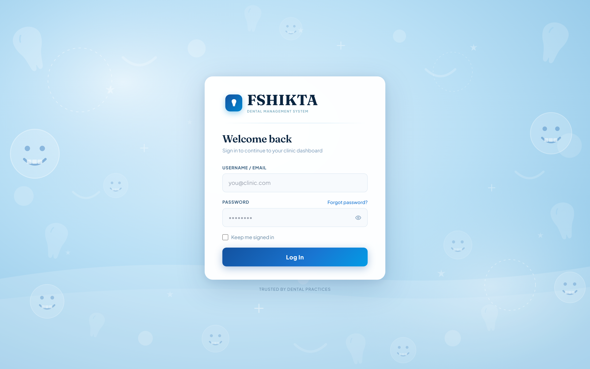

1. Open the clinic address in your browser (ask your manager for the exact address).
2. Type your email in **Username / Email**, then your **Password**. The eye icon shows what you typed if you need to check it.
3. Tick **Keep me signed in** only on a computer nobody else uses. Never on a shared front-desk machine.
4. Click **Log In**.

> **First time logging in?** Change your password straight away: click your name in the top-right corner, then **Change Password**.

**If your password does not work:**
- Check that Caps Lock is off; use the eye icon to see what you typed.
- After 5 wrong attempts the system pauses logins for one minute. Wait, then try again.
- Use **Forgot password?** on the login screen, or ask your manager to reset it. Do not share your login with anyone.

**Always log out** when you leave the desk, even for a short break. Everything you do is recorded against your name.

---

## 2. Getting around the screen

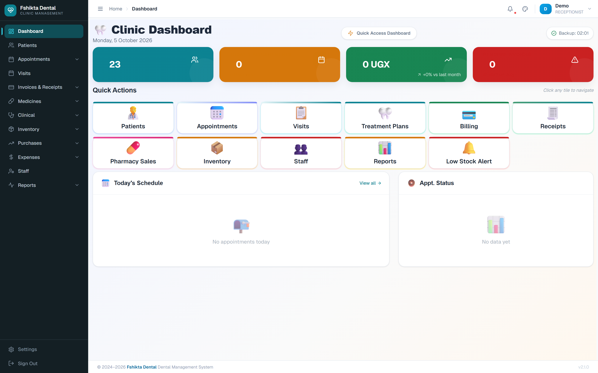

| Part of the screen | What it does |
|---|---|
| **Left menu (sidebar)** | All the sections of the system. Click a heading to expand it. |
| **Top bar** | Where you are (breadcrumb), the notification bell, the theme picker, and your name with your role under it. |
| **Main area** | Whatever you are working on. |

The menu items you will use every day:

| Menu item | Used for |
|---|---|
| **Dashboard** | Today at a glance: patients, appointments, money taken, alerts. |
| **Patients** | Register new patients, search for existing ones. |
| **Appointments → Appointments Calendar** | The calendar. Book, confirm, check in. |
| **Appointments → Draft Appointments** | Bookings not yet finalised. |
| **Visits** | Visits that are open right now. |
| **Invoices & Receipts → Invoices** | Bills. |
| **Invoices & Receipts → Receipts** | Proof of payment. |

Everything else in the menu belongs to the clinical or management teams. You can leave it alone.

**Sign Out** and **Settings** sit at the very bottom of the left menu.

### The dashboard tiles

Across the top are four coloured tiles: total **patients**, today's **appointments**, today's **revenue** in UGX with the change against last month, and an **alerts** count. Underneath, **Quick Actions** tiles jump straight to Patients, Appointments, Visits, Treatment Plans, Billing, Receipts and more — one click instead of hunting the menu. **Today's Schedule** lists the day's appointments.

---

## 3. Registering a new patient

Do this when somebody comes to the clinic **for the very first time**.

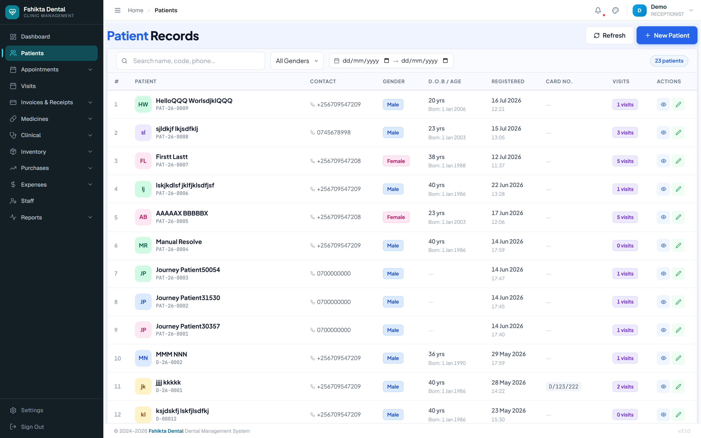

**Step 1.** Click **Patients** in the left menu.

**Step 2.** Before you register anyone, **search first** — type their phone number or surname in the search box. This stops duplicate records. If they already exist, use that record instead.

**Step 3.** Click **New Patient**. A form opens.

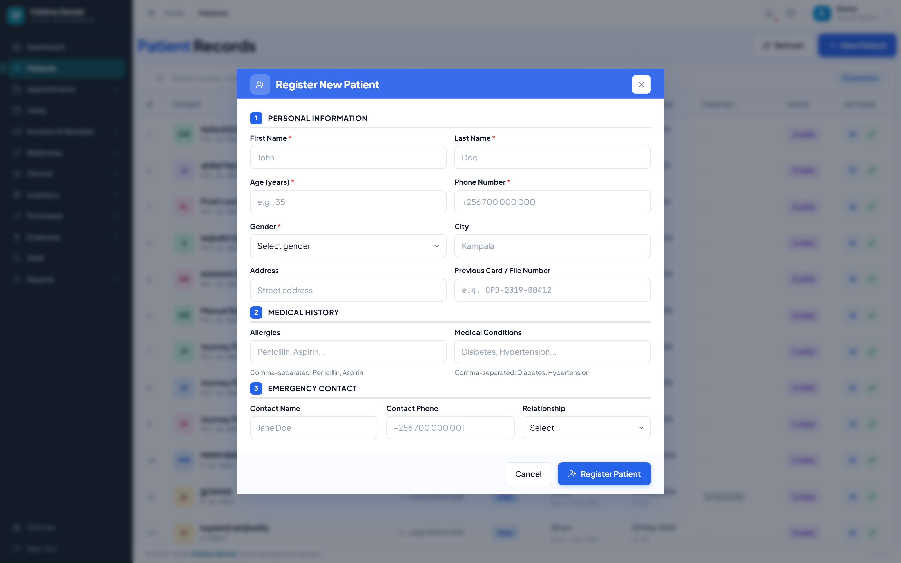

**Step 4.** Fill in the form. It has three parts.

### Personal information

| Field | Must fill? | Example / note |
|---|---|---|
| First Name | **Yes** | John |
| Last Name | **Yes** | Doe |
| Age (years) | **Yes** | Must be between 0 and 120 |
| Phone Number | **Yes** | +256 700 000 000 |
| Gender | **Yes** | Male / Female |
| City | No | Kampala |
| Address | No | Street, plot, area |
| Previous Card / File No. | No | Only if they have an old paper card |

### Medical history

| Field | What to type |
|---|---|
| Allergies | Separate each one with a comma: `Penicillin, Aspirin` |
| Medical Conditions | `Diabetes, Hypertension` |

> **Important:** Always ask about allergies. The doctor relies on what you type here. If the patient says "none", leave it empty — do not guess.

### Emergency contact

| Field | Example |
|---|---|
| Contact Name | Jane Doe |
| Contact Phone | +256 700 000 001 |
| Relationship | Spouse / Parent / Child / Sibling / Friend / Other |

**Step 5.** Click **Save**.

The system gives the patient a card number automatically, in the form **PAT-26-0147** (`PAT`, year, number). Write this on their paper card if you still keep one. They appear in the patient list immediately.

### Fixing a mistake
Open the patient's row and click the **pencil (Edit)** icon. Correct the field and save.

---

## 4. Finding an existing patient

On the **Patients** page you can:

- **Search** by name, card number (PAT-...) or phone number.
- **Filter** by gender, or by the date they registered.
- See at a glance: contact details, gender, age, when they registered, old card number, and how many visits they have had.

Click any row to open that patient's full record.

> Patients marked **inactive** are hidden from normal searches. If someone "has disappeared", ask your manager to check whether the record was made inactive.

---

## 5. Booking an appointment


**Step 1.** Click **Appointments** in the left menu. The calendar opens on today.

- Switch between **day** and **week** view with the buttons at the top.
- Each doctor has their own colour.
- The **Today** button jumps back to today if you get lost.

**Step 2.** Click **New**.

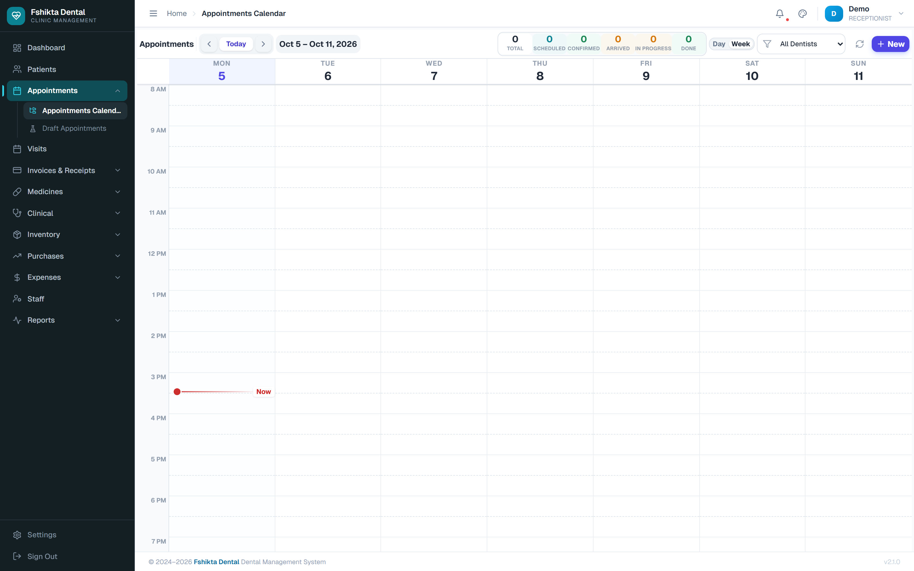

**Step 3.** Fill in the booking, top to bottom:

| # | Field | What to do |
|---|---|---|
| 1 | **Patient** | Search by name, card number or phone. Register them first if they are new. |
| 2 | **Dentist** | Choose the doctor. |
| 3 | **Appointment Type** | Regular Checkup, Cleaning, Filling, Extraction, Root Canal, Crown, Implant, Orthodontic, Emergency, Consultation. |
| 4 | **Duration** | 15 / 20 / 30 / 45 / 60 / 90 / 120 minutes. Ask the doctor if unsure. |
| 5 | **Walk-in** | Leave unticked for a booking made in advance. |
| 6 | **Date** | Pick from the calendar. |
| 7 | **Time** | Only the doctor's working hours are offered. |
| 8 | **Chief Complaint** | The patient's own words: "pain in lower right tooth". |
| 9 | **Additional Notes** | Anything else useful. |

**Step 4.** Click **Save**. The appointment appears on the calendar.

**Step 5.** Tell the patient the date, the time and the doctor's name before they leave.

### What the appointment statuses mean

| Status | What it means | Who sets it |
|---|---|---|
| **Draft** | A placeholder, not a real booking yet. Does not block the doctor's diary. | You |
| **Scheduled** | Booked, not yet confirmed. | You |
| **Confirmed** | You have confirmed it with the patient. | You |
| **Arrived** | Patient is in the clinic, waiting. | **You, at check-in** |
| **In Progress** | The doctor has started. | Doctor |
| **Completed** | Treatment finished. | Doctor |
| **Cancelled** | Called off. A reason is required. | You |
| **No Show** | The patient never came. | You |
| **Rescheduled** | Moved to another time. | You |

### Draft appointments

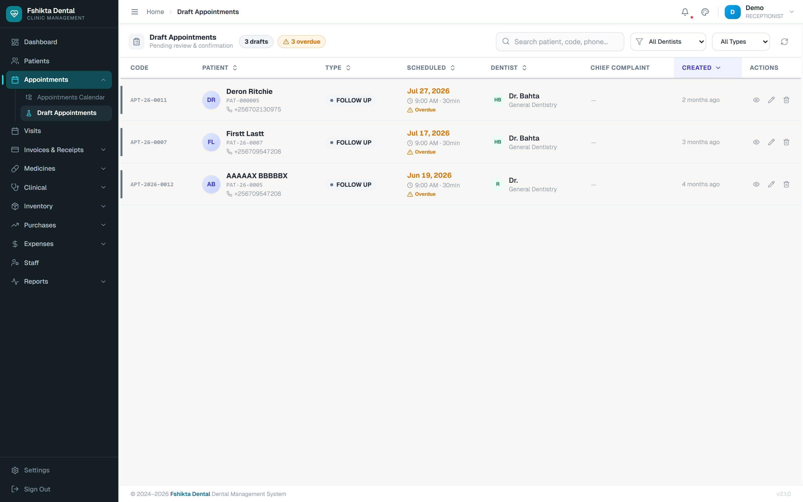

**Appointments → Draft Appointments** holds bookings you have not finished. Use drafts when a patient says "I'll call back to confirm the day". Drafts do not take up a slot in the doctor's diary.

---

## 6. Walk-in patients

A walk-in is a patient with no booking.

1. Register them first if they are new (section 3).
2. Click **Appointments → New**.
3. Tick the **Walk-in** box. The system offers the next free slot.
4. Save, then check them in straight away (section 7).

---

## 7. Checking a patient in

**This is the most important thing you do.** Until you check a patient in, the doctor does not know they are waiting.

1. Find the appointment on the calendar (or search the appointment list).
2. Click it. A panel slides out from the right showing the patient's name, card number, phone, age, the time, the doctor and the chief complaint.
3. Click **Patient Arrived**.

What happens then:
- The status changes to **ARRIVED**.
- The arrival time is recorded.
- The doctor gets an alert on their screen immediately.

4. Show the patient to the waiting area.

> You do not need to do anything else until the patient comes back to the desk to pay.

---

## 8. Changing or cancelling an appointment

Click the appointment on the calendar to open the side panel. What you can do depends on the current status:

| Current status | What you can do |
|---|---|
| Scheduled / Rescheduled | **Confirm Appointment**, or Cancel |
| Confirmed | **Patient Arrived**, or Cancel |
| Arrived, no visit started | The doctor can **Start Visit** |
| In Progress | Leave it alone — the doctor is treating the patient |

**To change the details:** click the **pencil (Edit)** icon in the panel. You can change the doctor, type, date, time, duration and notes. **The patient cannot be changed** once the appointment is saved — if you booked the wrong patient, cancel and book again.

**To cancel:** click **Cancel Appointment** and type a reason. The reason is kept permanently, so write something useful: "patient travelling", "doctor sick", not just "x".

**No show:** if the patient never arrives, set the appointment to **No Show** at the end of the day rather than leaving it as Confirmed.

---

## 9. Taking payment

The patient comes back to the desk after treatment. The doctor has already recorded what was done, and the bill is waiting for you.

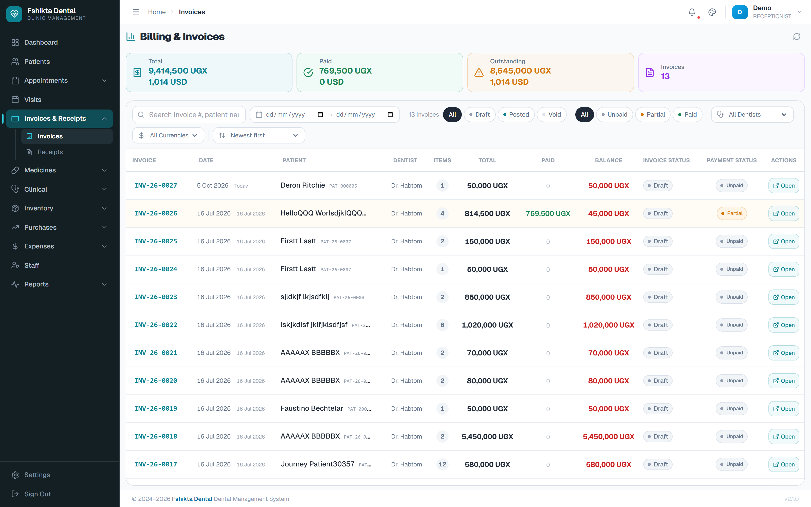

**Step 1.** Open the bill. Either:
- **Invoices & Receipts → Invoices**, then find the patient, **or**
- open the visit and click the **Bills** icon.

**Step 2.** Check the invoice status. It must say **Posted** (blue badge). That means the doctor has finished and the bill is final.

| Badge | Meaning | What you do |
|---|---|---|
| **Draft** | Still being prepared | Wait — do not take money yet |
| **Posted** | Final, ready for payment | Take payment |
| **Partially Paid** (amber) | Some money received | Take the remaining balance |
| **Paid** (green) | Settled in full | Nothing — print the receipt |
| **Void** | Cancelled | Take no money. Ask your manager |

**Step 3.** Read the total out to the patient, then click the green **Receive {amount}** button.

**Step 4.** Fill in the payment box:

| Field | What to enter |
|---|---|
| **Payment Amount** | How much the patient is actually handing over now |
| **Currency** | UGX by default; USD is available |
| **Payment Method** | See the table below |
| **Transaction Reference** | The mobile-money or cheque number. Leave blank for cash |
| **Received By** | Already filled in with your name |

### Which payment method to choose

| Method | Use it when |
|---|---|
| **Cash** | Notes and coins |
| **MTN Mobile Money** | MTN transfer |
| **Airtel Money** | Airtel transfer |
| **Visa Card** / **Mastercard** | Card on the POS machine |
| **Bank Transfer** | Money paid into the clinic's bank |
| **Cheque** | Cheque handed over |

**Step 5.** Click **Save**. A receipt is created automatically.

### Part payments
If the patient can only pay some of the bill, enter the smaller amount. The invoice becomes **Partially Paid** (amber) and shows the balance still owed. Take the rest on their next visit the same way.

### Money taken by mistake
Do not try to fix it by taking a negative payment. Tell your manager — the receipt has to be **voided**, which also reverses the accounting entries. Only do this if you have been given permission.

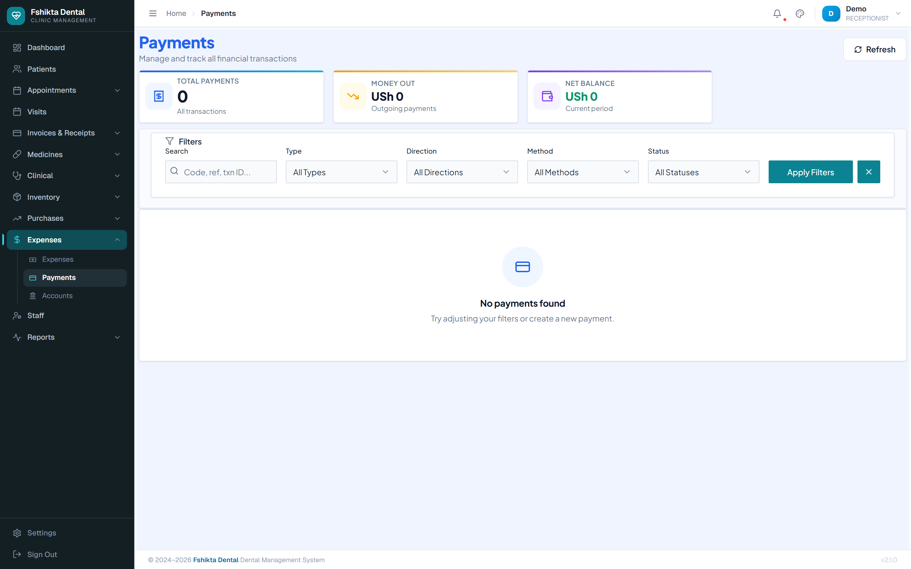

---

## 10. Printing receipts

1. Go to **Invoices & Receipts → Receipts**.
2. Find the receipt (search by patient or receipt number).
3. Open it and click **Print**.

Always give the patient a receipt, even for a part payment.

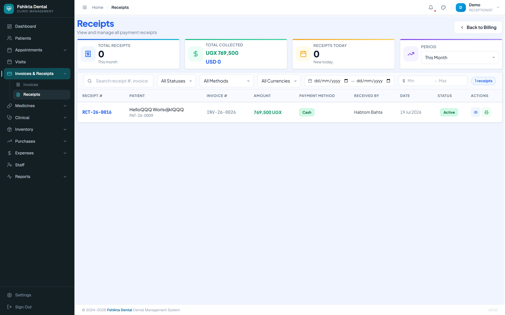

---

## 11. Notifications

The bell in the top bar lights up when something needs attention:

- an appointment status changed,
- a billing event,
- a low-stock warning (mostly for the stores team).

Click a notification to jump straight to the record. Clear them as you deal with them so the list stays meaningful.

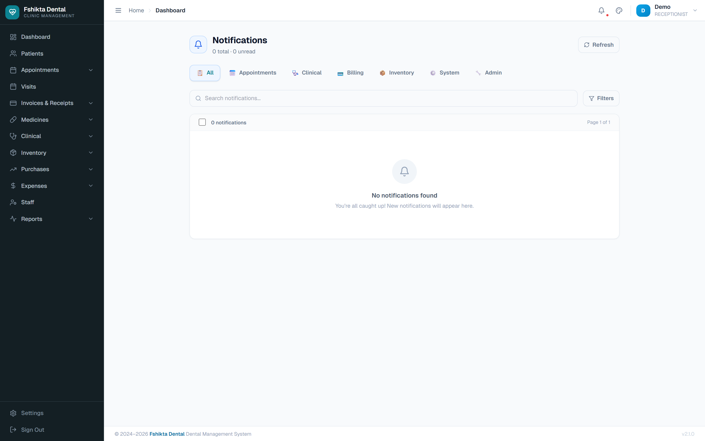

---

## 12. Your daily checklist

### Opening
- [ ] Log in.
- [ ] Open **Appointments** and look at today's list.
- [ ] Confirm any appointment still showing **Scheduled** — phone the patient.
- [ ] Check the **Dashboard** for today's totals.

### During the day
- [ ] Register new patients (search first, to avoid duplicates).
- [ ] Book appointments and walk-ins.
- [ ] **Check in every patient who arrives.**
- [ ] Take payment at check-out and print the receipt.

### Closing
- [ ] Count the cash drawer and compare it against the day's receipts.
- [ ] Make sure no appointment is still stuck on **Arrived** — if it is, ask the doctor whether the visit was finished.
- [ ] Mark anyone who never came as **No Show**.
- [ ] Confirm tomorrow's appointments.
- [ ] Log out.

---

## 13. Common problems and fixes

| Problem | What to do |
|---|---|
| "The patient is not in the system" | Search by phone number as well as name. They may be registered under a different spelling, or marked inactive. |
| Two records for the same patient | Do not delete anything. Tell your manager, who can merge or deactivate one. |
| No free slot with the doctor the patient wants | Check the week view, offer another doctor, or book a draft and call back. |
| **Receive** button does not appear | The invoice is still **Draft**. The doctor has not finished. |
| The doctor says the patient is not on their list | They were never checked in. Open the appointment and click **Patient Arrived**. |
| Wrong amount taken | Tell your manager — the receipt must be voided, not corrected by hand. |
| The page looks frozen or empty | Refresh the browser (F5). If it continues, tell your manager — the server may be down. |
| You are logged out suddenly | Normal after a long idle period. Log in again. |

---

## Changing your own password

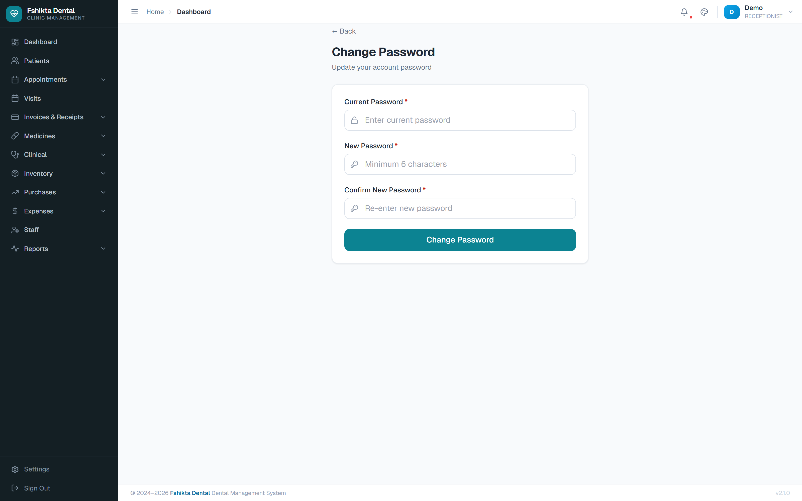

Click your name in the top-right corner, then **Change Password**. Enter your current password once and the new one twice.

---

## Quick reference — words you will hear

| Word | Meaning |
|---|---|
| **Appointment** | A booked time with a doctor. |
| **Visit** | The actual clinical encounter, from check-in to check-out. |
| **Invoice** | The bill for what was done. |
| **Receipt** | Proof of money received. |
| **Posted** | The bill is final and money can be taken. |
| **Void** | Cancelled, with a reason recorded. |
| **PAT-26-0147** | A patient card number. |
| **VIS-26-0032** | A visit number. |

---

*Questions this manual does not answer? Ask your General Manager. For clinical screens see the **Doctors & Nurses Manual**; for reports and money see the **Manager & Accountants Manual**.*
