# Doctors & Nurses Manual
### Fshikta Dental — Clinic Management System

*Version 2.1 · For dentists, dental officers and nursing staff · Last updated October 2026*

---

## Who this manual is for

You treat patients. The system is your patient record: it holds the chart, the notes, the treatment plan, the prescriptions and the images. Reception handles booking and money.

```
  RECEPTION              YOU                          RECEPTION
  ---------              ---                          ---------
  Checks patient in  ->  Start visit             ->   Takes payment
                         Chart + notes
                         Treatment plan
                         Procedures / sessions
                         Prescription
                         Complete visit
```

**The golden rule:** a patient must be **checked in by reception** before you can start a visit. If a patient is sitting in your chair but not on your list, ask the front desk to click **Patient Arrived**.

### What nurses do in the system
Nurses use the same screens as the dentist, usually for:
- recording **vital signs** (section 5),
- logging **materials used** during a session (section 8),
- preparing **prescriptions** for the dentist to check,
- uploading **images** (section 10).

Clinical decisions — diagnoses, treatment plans, final sign-off — stay with the dentist.

---

## Table of contents

1. [Logging in and your day's list](#1-logging-in-and-your-days-list)
2. [Starting a visit](#2-starting-a-visit)
3. [The visit screen explained](#3-the-visit-screen-explained)
4. [Clinical notes (SOAP)](#4-clinical-notes-soap)
5. [Vital signs](#5-vital-signs)
6. [The dental chart (odontogram)](#6-the-dental-chart-odontogram)
7. [Recording conditions and diagnoses](#7-recording-conditions-and-diagnoses)
8. [Treatment plans, procedures and sessions](#8-treatment-plans-procedures-and-sessions)
9. [Prescriptions](#9-prescriptions)
10. [Imaging and lab orders](#10-imaging-and-lab-orders)
11. [Completing a visit](#11-completing-a-visit)
12. [Looking up a patient's history](#12-looking-up-a-patients-history)
13. [Catalogues you can maintain](#13-catalogues-you-can-maintain)
14. [Common problems and fixes](#14-common-problems-and-fixes)

---

## 1. Logging in and your day's list

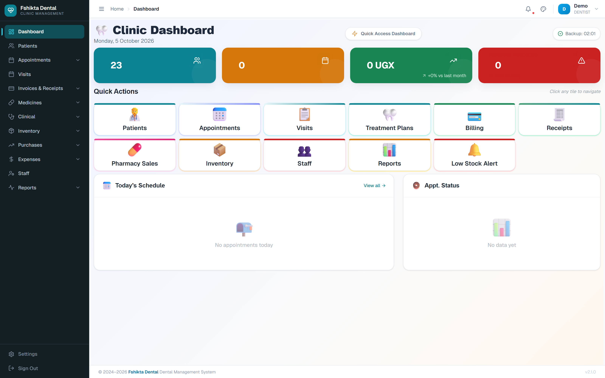

1. Log in with your own email and password. Never use a colleague's login — every entry is stamped with your name and becomes part of the legal record.
2. The **Dashboard** shows today's appointments and how many patients are waiting.
3. Click **Visits** in the left menu to see the patients who have been checked in.

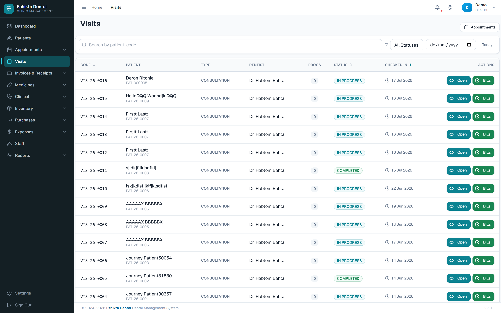

| Visit status | Meaning |
|---|---|
| **ARRIVED** | Checked in by reception, waiting for you |
| **IN_PROGRESS** | You have started examining or treating |
| **COMPLETED** | Clinical work finished — notes become read-only |
| **CANCELLED** | Visit called off |

---

## 2. Starting a visit

There are two ways in:

**From the appointment:** open **Appointments**, click the patient's appointment, and in the side panel click **Start Visit**. (The button only appears once the status is **ARRIVED**.)

**From the visits list:** open **Visits** and click **Continue Visit** on a patient who is already in progress.

The system creates a visit record with its own number, like **VIS-26-0032**, and opens the visit screen.

---

## 3. The visit screen explained

At the top you see a header strip with everything you need to confirm you have the right patient:

- patient name and card number (PAT-...),
- visit number (VIS-...),
- your name as the treating dentist,
- appointment type, date of birth and gender,
- a **status badge** (ARRIVED / IN_PROGRESS / COMPLETED),
- action buttons: **Start Examination** and, later, **Complete Visit**.

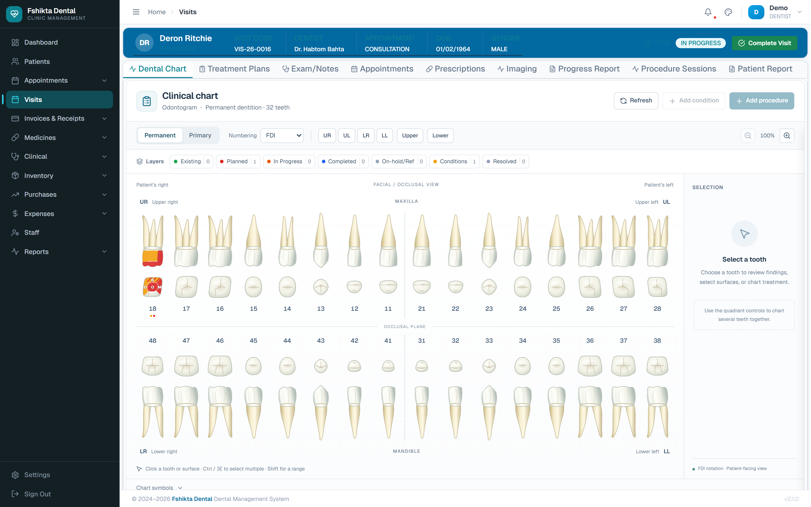

Underneath are the tabs where all the work happens:

| Tab | What it is for |
|---|---|
| **Dental Chart** | The odontogram. Conditions and treatments per tooth. |
| **Treatment Plans** | Plan the course of care; add procedures; run sessions. |
| **Exam/Notes** | SOAP notes, findings, recommendations, vital signs. |
| **Appointments** | This patient's other appointments. |
| **Prescriptions** | Medicines prescribed. |
| **Imaging** | X-rays and photographs. |
| **Progress Report** | Narrative progress notes across visits. |
| **Procedure Sessions** | Every session performed, with its details. |
| **Patient Report** | A printable summary of the patient. |

> Click **Start Examination** when you actually begin. That moves the visit to **IN_PROGRESS** and tells reception the patient is with you.

---

## 4. Clinical notes (SOAP)

**Tab: Exam/Notes**

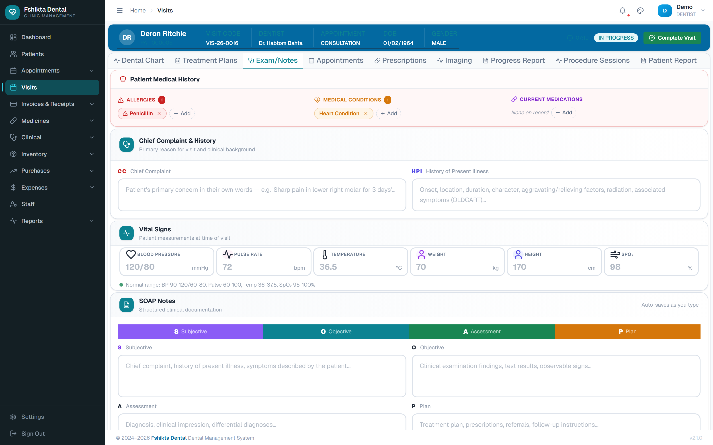

The tab opens with a **Patient Medical History** banner across the top: **Allergies**, **Medical Conditions** and **Current Medications**, each with a count and an **+ Add** button. Read it before you touch the patient, and add anything the patient tells you that is missing.

Under it, **Chief Complaint & History** holds **CC** (the patient's primary concern in their own words) and **HPI** (onset, location, duration, character, aggravating and relieving factors, radiation, associated symptoms — the OLDCART prompts are in the field).

Then come **Vital Signs** (section 5) and the **SOAP Notes** block. **Everything auto-saves as you type** — there is no Save button to forget.

| Section | What goes in it |
|---|---|
| **S — Subjective** | What the patient tells you. Chief complaint (CC) in their own words, and the history of the present illness (HPI): onset, duration, severity, what makes it better or worse. |
| **O — Objective** | What you find. Intra-oral and extra-oral examination, radiographic observations, test results, measurable signs. |
| **A — Assessment** | Your clinical judgement. Diagnosis or impression, differential diagnoses, ICD-10 codes from the searchable list. |
| **P — Plan** | What you will do. Procedures, prescriptions, referrals, follow-up instructions. |

A progress bar at the top shows **"X/4 fields filled"**. Fill all four before completing the visit.

### Findings and recommendations

| Field | Purpose |
|---|---|
| **Clinical Findings** | Detailed intra-oral and extra-oral findings. |
| **Patient Recommendations** | Post-treatment instructions, diet advice, oral-hygiene advice, follow-up schedule. The patient can be given this. |

> Once the visit is **COMPLETED** the notes become **read-only**. Write them before you sign off.

---

## 5. Vital signs

Within the **Exam/Notes** tab there are six vital-sign cards. Each shows its unit and the normal range. Values outside the normal range are flagged on screen. Vitals auto-save.

| Vital | Example | Unit | Normal range |
|---|---|---|---|
| Blood Pressure | 120/80 | mmHg | 90–120 / 60–80 |
| Pulse Rate | 72 | bpm | 60–100 |
| Temperature | 36.5 | °C | 36–37.5 |
| Weight | 70 | kg | — |
| Height | 170 | cm | — |
| SpO₂ | 98 | % | 95–100 |

This is usually the nurse's first task once the patient sits down.

---

## 6. The dental chart (odontogram)

**Tab: Dental Chart**


The chart shows every tooth in FDI notation (11–18, 21–28, 31–38, 41–48). Click a tooth to select it; click several to select a group.

### What the colours mean

| Colour | Meaning |
|---|---|
| **Amber** | A condition (for example caries) |
| **Red** | Planned treatment, not yet done |
| **Blue** | Completed procedure |
| **Green** | Existing work (done elsewhere or previously) |

### The tooth detail drawer
Click a tooth to open a drawer on the right listing, for that tooth:
- all recorded **conditions**,
- **planned** treatments,
- **completed** work.

From the drawer you can edit or delete any of those entries.

### Chart controls

| Control | What it does |
|---|---|
| **Permanent / Primary** | Switch between the adult and the deciduous dentition |
| **Numbering** | FDI by default |
| **UR / UL / LR / LL / Upper / Lower** | Select a whole quadrant or arch at once |
| **Layers** | Show or hide each layer, with a live count: Existing, Planned, In Progress, Completed, On-hold/Ref, Conditions, Resolved |
| **Zoom** | Enlarge the chart |
| **Refresh** | Reload after someone else has charted |

Selecting teeth: click a tooth or a surface; **Ctrl** (or **Cmd**) to add more; **Shift** for a range. The **Selection** panel on the right shows what you have picked.

With teeth selected, the two buttons at the top right become available: **Add condition** and **Add procedure**. Those are the routes into everything below.

---

## 7. Recording conditions and diagnoses

A condition is a diagnosis attached to a tooth and its surfaces.

### 7.1 Adding a condition

**Dental Chart → select the tooth or teeth → Add condition**

The dialog has two panels.

**Left — the condition catalogue:** search by name or browse categories (Caries, Periodontal, Pulpal, Fracture and so on). Each condition may carry ICD-10, SNODENT or SNOMED CT codes. Click one to select it.

**Right — the details:**

| Field | What to set |
|---|---|
| **Date** | Defaults to today |
| **Provider** | Your name, pre-filled |
| **Status** | Active / Monitored / In Treatment / Resolved / Ruled Out |
| **Severity** | Mild / Moderate / Severe |
| **Surfaces** | Click the affected surfaces on the radial picker |
| **Notes** | Free clinical text |

**If you selected several teeth**, choose either:
- **Same condition to all teeth** — identical entry on every tooth, or
- **One entry per tooth** — different surfaces or notes for each.

Click **Save Condition**. The surfaces turn **amber** on the chart.

### 7.2 Editing a condition

1. Click the tooth, then **Edit** under the CONDITION section of the drawer.
2. Change severity, status, surfaces or notes.
3. For a clinical change the system asks for an **edit reason** — this goes into the audit trail.
4. Click **Save Changes**.

> If a colleague edited the same condition at the same moment you will see a **conflict** warning. Refresh the chart and redo your change — do not force it.

### 7.3 Deleting a condition

Click the tooth → CONDITION → **Delete**, type a **reason** (required), confirm.

The condition is **soft-deleted**: it disappears from the chart but stays in the patient's audit history, and an administrator can restore it.

### 7.4 Condition statuses

| Status | Meaning |
|---|---|
| **ACTIVE** | Present and untreated |
| **MONITORED** | Watching it, no treatment yet |
| **IN_TREATMENT** | Treatment underway |
| **RESOLVED** | Resolved |
| **RULED_OUT** | Excluded diagnostically |

**Auto-resolve:** if you link a condition to a procedure and that procedure is completed, the condition moves to **RESOLVED** by itself. Link caries to the filling that treats it and the chart keeps itself tidy.

---

## 8. Treatment plans, procedures and sessions

Three levels, from biggest to smallest:

```
  TREATMENT PLAN        "Upper arch restoration"
     |
     +-- PROCEDURE      "Composite filling, tooth 26"
     |      |
     |      +-- SESSION   the visit where you actually do it
     |      +-- SESSION   (root canals need several)
     |
     +-- PROCEDURE      "Root canal 36"
```

**Tab: Treatment Plans** (also on the patient record)

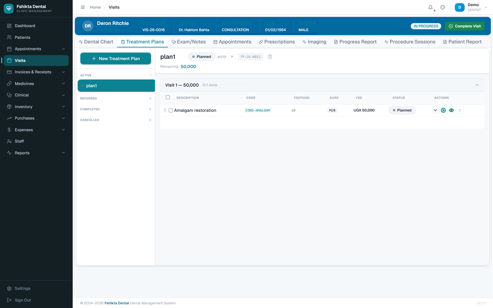

### 8.1 Creating a treatment plan

1. Click **+ New Treatment Plan**.
2. Give it a clear **title**: "Upper Arch Restoration", "Root Canal 26".
3. Choose the **provider**.
4. Click **Create**. A plan code is generated and the plan appears under **Active** in the left sidebar.

Plans are grouped as **Active**, **Referred**, **Completed** and **Cancelled**. Click a plan to load its procedures.

**Plan housekeeping:**
- **Rename:** pencil icon next to the title.
- **Status override:** set ON_HOLD or REFERRED manually; choose **Resume Auto** to let the system work the status out again.
- **Other fields:** **Edit** for priority, diagnosis, consent status, notes.
- **Delete:** only possible when the plan has no procedures. Otherwise cancel it.
- **Duplicate:** copies the plan with all its procedures — handy for the opposite arch.

The top of the panel shows a **progress bar**, the **cost split** (completed versus remaining) and **procedure counts**.

| Plan status | Meaning |
|---|---|
| **PLANNED** | Created, nothing started |
| **IN_PROGRESS** | At least one procedure started |
| **COMPLETED** | All procedures done |
| **ON_HOLD** | Paused (manual) |
| **REFERRED** | Sent to a specialist (manual) |
| **CANCELLED** | Abandoned (manual) |

PLANNED, IN_PROGRESS and COMPLETED work themselves out from the procedures. Manual settings stick until you press **Resume Auto**.

### 8.2 Adding a procedure

**Treatment Plans → + Add Treatment** (or **Add procedure** from the dental chart)

**Tab 1 — New Treatment** (planned and billable):

| # | Step |
|---|---|
| 1 | **Search the catalogue** by name, or filter by category |
| 2 | **Provider** — who will perform it |
| 3 | **Treatment plan** — pick one, or create a new one here |
| 4 | **Teeth** — pre-filled from your chart selection, FDI notation |
| 5 | **Surfaces** — Mesial, Occlusal, Distal, Buccal, Lingual |
| 6 | **Link conditions** (optional) — tick the active conditions this treats, so they auto-resolve |
| 7 | **Session type** — **Single** for one sitting, **Multi** for several (set how many) |
| 8 | **Payment type** — **Pay in Full** (billed upfront) or **Pay Partially** (billed per session, with a deposit) |
| 9 | **Price** — calculated automatically; click **Edit** to override |
| 10 | **Notes** — optional |
| 11 | **Add to Plan** |

**Tab 2 — Existing Treatment** (chart only, no billing): for recording work already done elsewhere. Pick the procedure, set surfaces, add notes, click **Add as Existing**.

### How prices are worked out

| Pricing model | Calculation | Typical use |
|---|---|---|
| **Fixed** | One flat price | Consultation |
| **Per Tooth** | Price × number of teeth | Fillings |
| **Per Arch** | Price per arch | Full-arch tray |
| **Per Session** | Price per session | Root canal over 3 visits |
| **Per Bracket** | Price per bracket | Orthodontics |
| **Per Unit** | Generic per unit | Lab work |

**Procedure categories:** Consultation, Procedure, Diagnostic, Medication, Therapy, Surgical, Preventive, Administrative, Other.

### 8.3 Editing a procedure

Three-dot menu (⋮) on the procedure row → **Edit**. Some fields lock once work or money is involved:

| Field | Editable? |
|---|---|
| Notes, provider, sequence, visit group, scheduled date | Always |
| Surfaces | Always (the change is recorded as a before/after diff) |
| Tooth numbers | Only while no session has been performed |
| Price, discount, tax | Only while the invoice is Draft or absent — a Posted or Paid invoice locks pricing |
| Session configuration (single/multi, count) | Only while no session exists |
| **Reason for edit** | **Always required** |

### 8.4 Running a session

A session is one clinical sitting. Click the **play button (▶)** on the procedure row.

| Field | What to record |
|---|---|
| **Performed Date** | Defaults to today |
| **Provider** | Your name, changeable |
| **Surfaces** | Confirm what you actually treated |
| **Session Phase** | Assessment, Preparation, Cleaning, Shaping, Filling, Cementation, ... |
| **Per-Tooth Status** | For multi-tooth work: pending / in-progress / completed / skipped per tooth |
| **Outcome** | Partial or Completed |
| **Is Final Session?** | Tick if this is the last one (closing early needs a reason) |
| **Notes** | Clinical notes for this sitting |
| **Materials / Inventory** | Log what was consumed — this is what keeps stock accurate |
| **Imaging Links** | Attach images taken during the session |

Click **Execute**. In one step the system records the session, writes the chart entries, raises the financial entry where the billing type requires it, and links the images.

> Double-clicking **Execute** does **not** create two sessions — the system guards against that.

### 8.5 Correcting a session

**Quick edit** (session still pending or in progress): the edit button on the session row — change status, date, notes, phase, price. Saves immediately.

**Audited edit** (completed or otherwise final): **Procedure Detail → Session → Edit**. You may change surfaces, notes, phase, date, provider, outcome and per-tooth statuses. A **reason is required**, and the system keeps a full record of surfaces added and removed, notes before and after, and who made the change.

### 8.6 Voiding a session

**Procedure Detail → Session → Void/Delete.** Pick a reason (wrong patient, duplicate, incorrect procedure, session did not happen, data error, other) and confirm.

Voiding reverses **everything** that session caused: chart entries, financial entries, image links, progress-report links. The session stays visible as VOIDED in the audit trail.

> Voiding a session does **not** delete the procedure. Other sessions on that procedure are untouched.

| Session status | Meaning |
|---|---|
| **PENDING** | Planned, not started |
| **IN_PROGRESS** | Being performed |
| **COMPLETED** | Finished |
| **SKIPPED** | Bypassed |
| **CANCELLED** | Abandoned |
| **VOIDED** | Reversed |

### 8.7 Extra sessions

If treatment needs more sittings than planned, click **+ Add Session** on the procedure row. It behaves exactly like a normal session.

### 8.8 Cancelling or deleting a procedure

**Cancel** (⋮ → Cancel): choose or type a reason. Chart entries are superseded, pending financial entries voided, pending sessions cancelled. You can cancel from PLANNED, IN_PROGRESS or ON_HOLD, but **not** from COMPLETED — completed work is a legal record. Payments do not block cancellation; refunds are handled separately by accounts.

**Delete** (⋮ → Delete): only when nothing has been performed, nothing paid, and the procedure is not completed. The system checks first and, if it is not allowed, tells you why and offers Cancel instead. Delete is a soft delete and keeps the audit trail.

### 8.9 Procedure detail view

Click the procedure name (or ⋮ → Detail) for a full read-only summary: status, teeth and surfaces, the complete pricing breakdown, the session timeline with every session expandable, linked conditions, audit entries, and a **Continue Treatment** button that opens the next pending session.

### 8.10 Reordering

Drag a procedure row up or down to change its order. To move several at once, tick them, click **Move** and pick the target visit number.

---

## 9. Prescriptions

**Tab: Prescriptions**

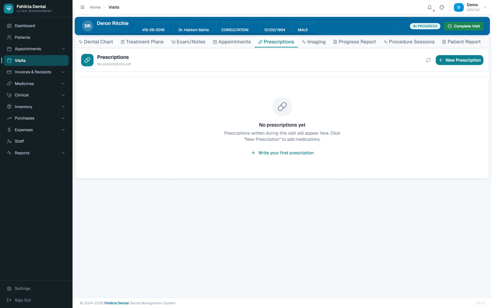

1. Click **New Prescription**.
2. Search the **drug catalogue** by name.
3. For each drug set:
   - **Dosage** — 500 mg
   - **Frequency** — twice daily, every 8 hours
   - **Duration** — 7 days
   - **Quantity** — 14 tablets
   - **Refills** — if any
4. The system generates a prescription code (**RX-26-0088**).
5. **Print** it, or send it to the pharmacy.

**Stock check:** the system compares the prescription against pharmacy stock and warns you if a drug is unavailable, so you can choose an alternative while the patient is still with you.

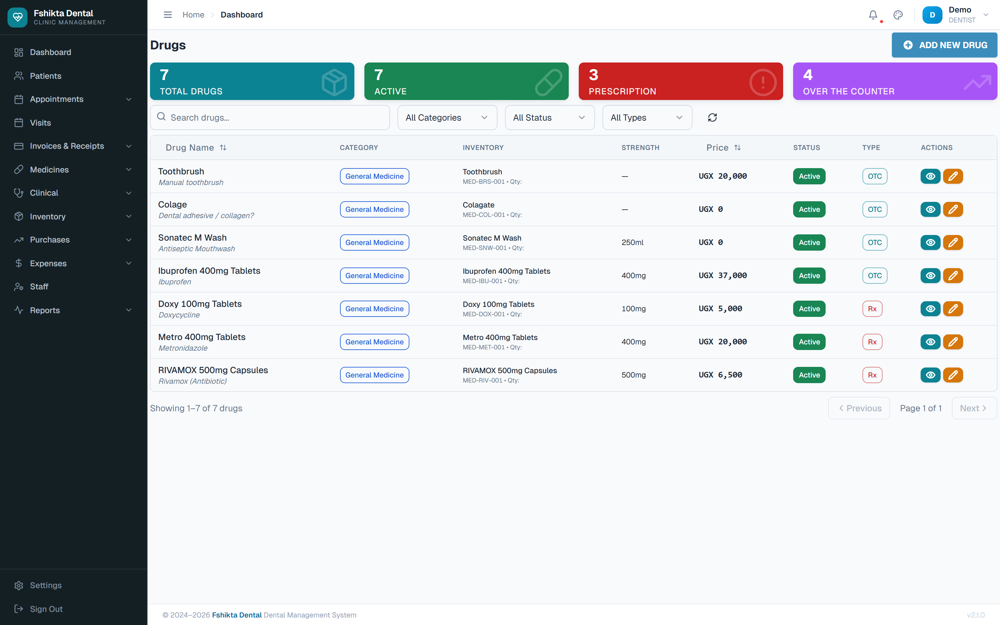

Check the patient's **allergies** (recorded at registration, shown on the patient record) before prescribing.

---

## 10. Imaging and lab orders

### Imaging

**Tab: Imaging** — upload radiographs and photographs straight onto the patient record.

| Field | Options |
|---|---|
| **Image Type** | Periapical, Bitewing, Panoramic, CBCT, Cephalometric, Intraoral Photo, Extraoral Photo |
| **Stage** | Pre-treatment, Post-treatment, Review, Emergency |
| **Classification** | Normal, Abnormal, Pathological |

Images are stored on the clinic server and linked to the visit. Earlier images stay available for comparison.

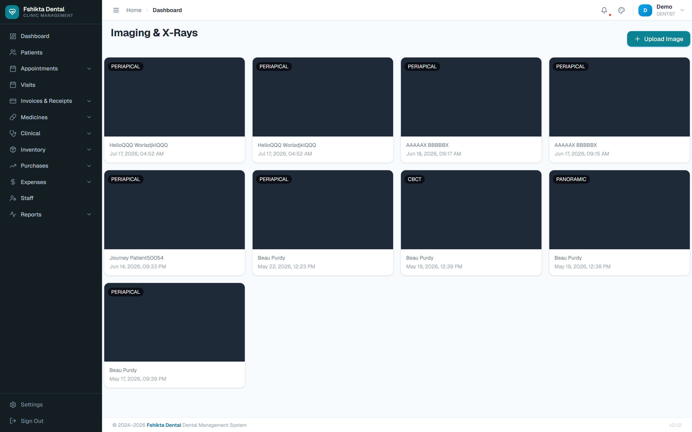

### Lab orders

Create lab orders against the visit. Each order moves Pending → In Progress → Completed, and results can be attached when they come back.

---

## 11. Completing a visit

Before you sign off, check:

- [ ] All four SOAP sections are filled (the progress bar reads 4/4).
- [ ] Vital signs are recorded.
- [ ] Every condition you found is on the chart.
- [ ] Every procedure you performed has a session recorded.
- [ ] Materials used are logged.
- [ ] Prescriptions are issued and printed.

Then click **Complete Visit**. The system:
- sets the visit to **COMPLETED** and timestamps it,
- sets the appointment to **COMPLETED**,
- generates the financial entries for each procedure, so reception can take payment,
- locks the clinical notes.

**Follow-up:** you can set a follow-up date and notes. Reception sees this and offers the patient the next appointment.

> After completion, corrections need the audited edit routes described in section 8.5. Get it right before you click.

---

## 12. Looking up a patient's history

**Patients → select the patient.** The record has its own tabs:

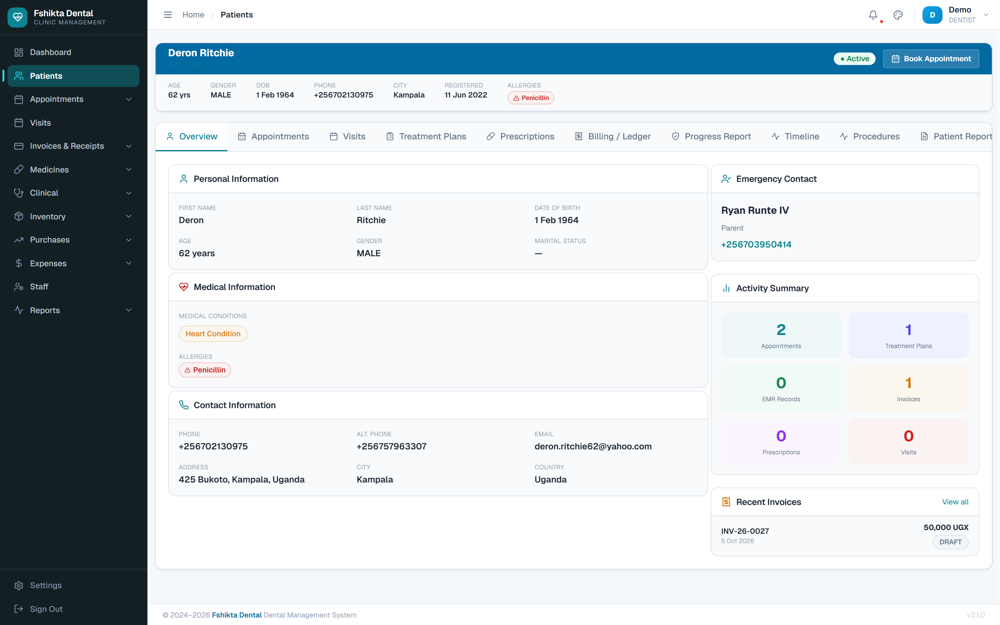

| Tab | Contents |
|---|---|
| **Examination** | Past SOAP notes and findings |
| **Conditions** | Every condition recorded, with status |
| **Treatment Plan** | All plans, past and present |
| **Procedures** | Everything performed |
| **Visits** | Visit history |
| **Prescriptions** | All medicines prescribed |
| **Progress Reports** | Narrative progress over time |
| **Billing** | What was charged and paid (read-only for you) |
| **Patient Report** | Printable summary |

Use this before treating a returning patient — allergies, medical conditions and previous work are all here.

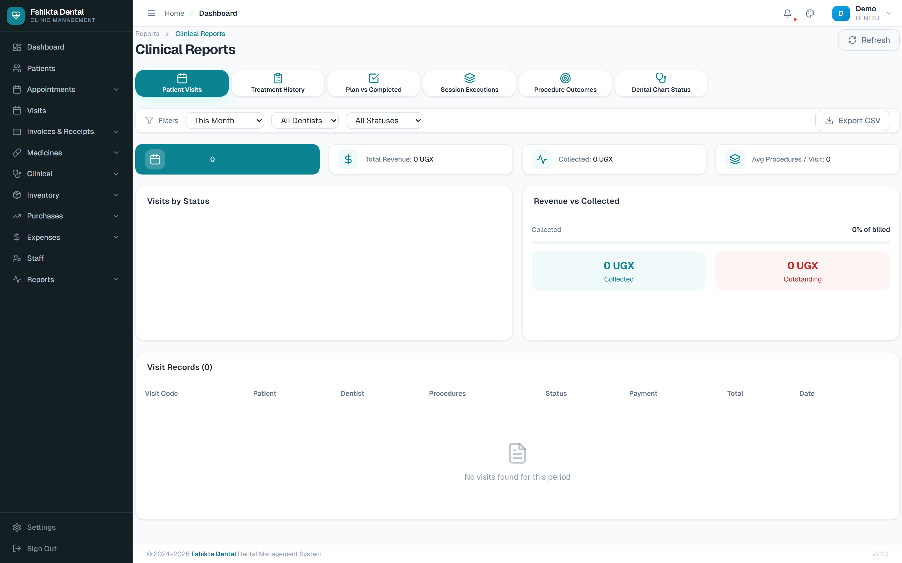

---

## 13. Catalogues you can maintain

These are shared lists that everyone's records depend on. Change them carefully.

### Conditions / Diagnosis catalogue
**Clinical → Conditions/Diagnosis**

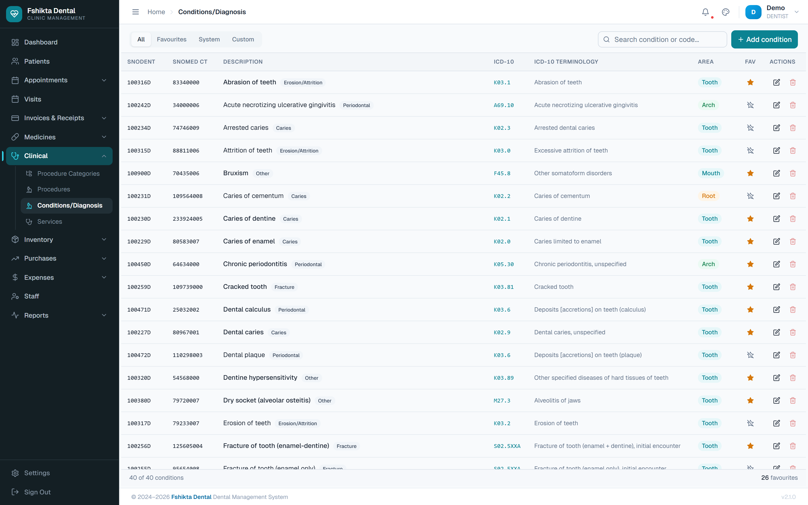

Search by name or code; filter by **All / Favourites / System / Custom**; star the ones you use daily so they come up first.

| Field | Notes |
|---|---|
| Name | Clinical name |
| Category | Caries, Periodontal, Pulpal, Fracture, ... |
| Coding System | ICD-10, SNODENT, SNOMED CT, Custom |
| ICD-10 Code | e.g. K02.9 |
| Affected Area | Tooth / Root / Arch / Quadrant / Soft Tissue |
| Tooth-Specific | Does it apply to one tooth? |
| Requires Surface | Must a surface be chosen? |
| Default Severity | Mild / Moderate / Severe |
| Auto-Resolve | Resolve automatically when the linked procedure completes |

Only **custom** conditions can be deleted. System ones are locked.

### Procedures catalogue
**Clinical → Procedures** and **Procedure Categories** — the master list of treatments and their prices.

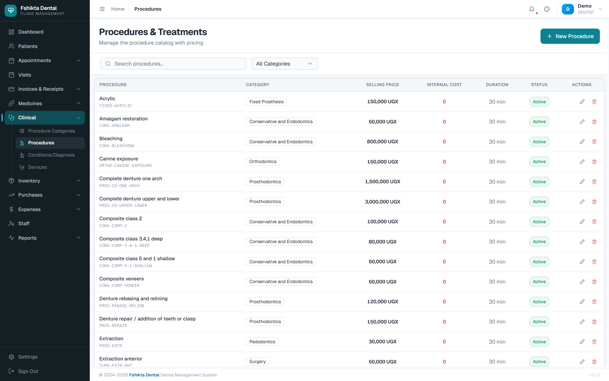

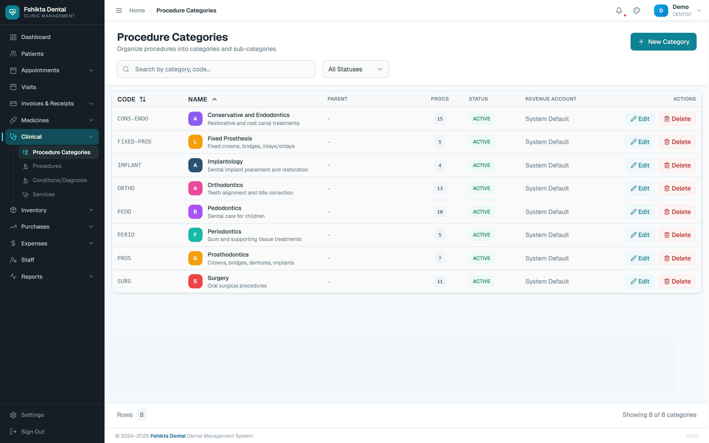

> Prices here drive patient bills. Agree changes with the General Manager before editing.

---

## 14. Common problems and fixes

| Problem | What to do |
|---|---|
| **Start Visit** is greyed out | The patient has not been checked in. Ask reception to click **Patient Arrived**. |
| The patient is in the chair but not on my list | Same cause — not checked in. |
| I cannot edit my notes | The visit is COMPLETED. Notes are read-only by design; use the audited edit routes or add a progress report. |
| "Conflict" warning when saving | A colleague edited the same record. Refresh and redo your change. |
| I cannot change the price | The invoice is already Posted or Paid. Accounts must handle it. |
| I cannot change the tooth numbers | A session has already been performed. Cancel that procedure and add a correct one. |
| I cannot delete a procedure | Work, payment or completion blocks deletion. Use **Cancel** with a reason. |
| I executed a session on the wrong patient | **Void** the session, reason "wrong patient", then record it on the correct patient. |
| The drug I want is out of stock | The warning is from live pharmacy stock. Prescribe an alternative, or ask the pharmacist. |
| An image will not upload | Check the file size and format; try again. If it persists, tell your administrator. |

---

## Quick reference

| Term | Meaning |
|---|---|
| **SOAP** | Subjective, Objective, Assessment, Plan |
| **CC** | Chief complaint |
| **HPI** | History of present illness |
| **FDI notation** | Two-digit tooth numbering (11–18, 21–28, 31–38, 41–48) |
| **Odontogram** | The dental chart |
| **Chart entry** | One record on the odontogram for one tooth |
| **Condition** | A diagnosis attached to a tooth |
| **Procedure** | A treatment to be performed |
| **Session** | One sitting in which a procedure is performed |
| **Soft delete** | Hidden from view but kept in the audit trail |
| **VIS-26-0032** | A visit number |
| **RX-26-0088** | A prescription number |

---

*For booking, check-in and payment screens see the **Receptionist Manual**. For reports, stock and money see the **Manager & Accountants Manual**.*
