# General Manager & Accountants Manual
### Fshikta Dental — Clinic Management System

*Version 2.1 · For the practice owner, general manager, accountants and stores staff · Last updated October 2026*

---

## Who this manual is for

You are not booking patients or filling teeth. You are answerable for the money, the stock, the staff and the records. This manual covers the parts of the system that exist for you:

```
  OPERATIONS                     YOU
  ----------                     ---
  Reception takes money   ->     Reconcile, post, report
  Doctors treat patients  ->     Measure performance, cost, outcomes
  Stores issue supplies   ->     Value stock, approve purchases
  Everyone clicks         ->     Audit trail, backups, access control
```

Four questions you should be able to answer at any time, and where the answer lives:

| Question | Where |
|---|---|
| What did we earn today / this month? | **Dashboard**, then **Reports → Sales & Receipts** |
| Who owes us money? | **Invoices**, filtered by Unpaid / Partially Paid |
| What is the stock worth and what is running out? | **Reports → Inventory Report**, **Stock Ledger** |
| Who changed this record, and when? | **Audit Log** |

---

## Table of contents

1. [Logging in and the dashboard](#1-logging-in-and-the-dashboard)
2. [Reports and analytics](#2-reports-and-analytics)
3. [Invoices and the money flow](#3-invoices-and-the-money-flow)
4. [Receipts, payments and daily reconciliation](#4-receipts-payments-and-daily-reconciliation)
5. [The general ledger](#5-the-general-ledger)
6. [Cash and bank accounts](#6-cash-and-bank-accounts)
7. [Expenses](#7-expenses)
8. [Fixed assets](#8-fixed-assets)
9. [Suppliers and purchases](#9-suppliers-and-purchases)
10. [Inventory and stock control](#10-inventory-and-stock-control)
11. [Pharmacy](#11-pharmacy)
12. [Price list (billing services)](#12-price-list-billing-services)
13. [Staff and access](#13-staff-and-access)
14. [Clinic settings](#14-clinic-settings)
15. [Audit log](#15-audit-log)
16. [Backups](#16-backups)
17. [Routines: daily, weekly, monthly](#17-routines-daily-weekly-monthly)
18. [Common problems and fixes](#18-common-problems-and-fixes)

---

## 1. Logging in and the dashboard

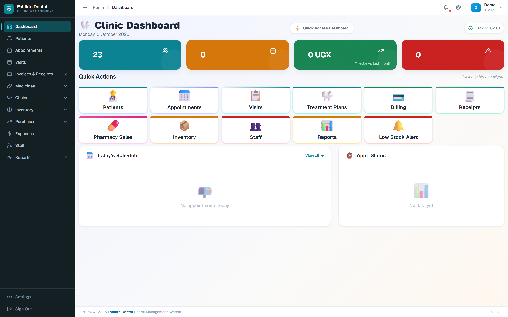

Log in with your own account. Admin accounts can see and change almost everything, so treat the password accordingly and never share it.

The dashboard is your morning check-in:

| Tile | What it tells you |
|---|---|
| **Today's Appointments** | How busy the clinic is today |
| **Revenue (Today)** | Money collected so far today |
| **Active Patients** | Size of the patient base |
| **Appointment Breakdown** | Scheduled / Confirmed / Arrived / In Progress / Completed |

A large number of appointments stuck on **Arrived** in the afternoon means patients are waiting too long, or visits are not being completed in the system. Both are worth chasing the same day.

---

## 2. Reports and analytics

**Sidebar → Reports**

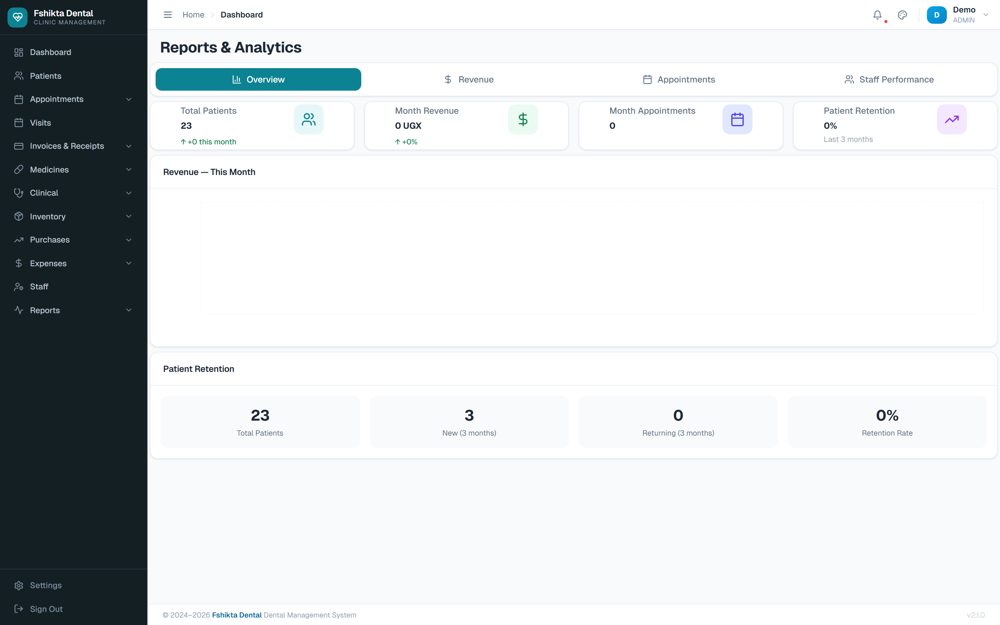

| Report | What it answers |
|---|---|
| **Medical Report** | Clinical activity and outcomes: procedure completion rates, planned versus completed, diagnosis activity by dentist, ICD-10 breakdown, re-treatment candidates |
| **Patients Report** | Registration trend, age and gender spread, insurance split, city distribution, growth rate, patient retention |
| **Sales & Receipts** | Revenue by day, by dentist, by payment method; revenue versus collected; average per transaction |
| **Expenses & Payments** | Operating costs, supplier payments, spend by category |
| **Inventory Report** | Stock levels, valuation, usage trend, waste |
| **General Ledger** | Chart of accounts, journal, trial balance, income statement, balance sheet |
| **Audit Log** | Every state change in the system |

### The reports that matter most

**Sales & Receipts** — look at **Revenue vs Collected**. Revenue is what was invoiced; collected is what actually arrived. A widening gap means debt is building and nobody is chasing it.

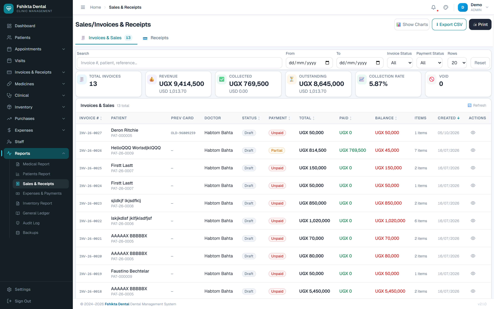

**Dentist Performance — This Month** shows revenue by dentist, completion rates and average duration. Use it for workload balance, not just ranking.

**Patients Report** — registration trend plus retention tells you whether growth is new patients or returning ones.

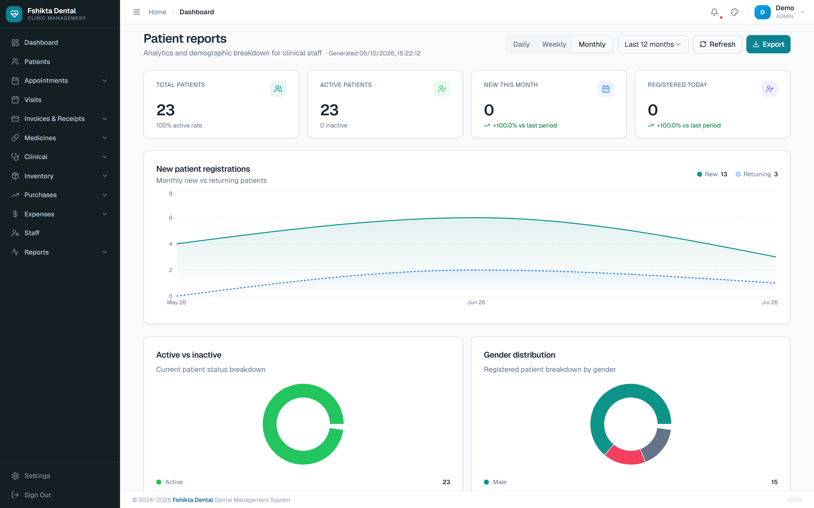

**Treatment and visit reports** — completion rates, planned versus actual cost, session status. Plans sitting at PLANNED for months are lost revenue and usually a follow-up failure.

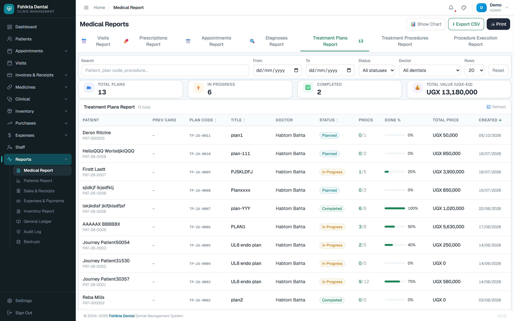

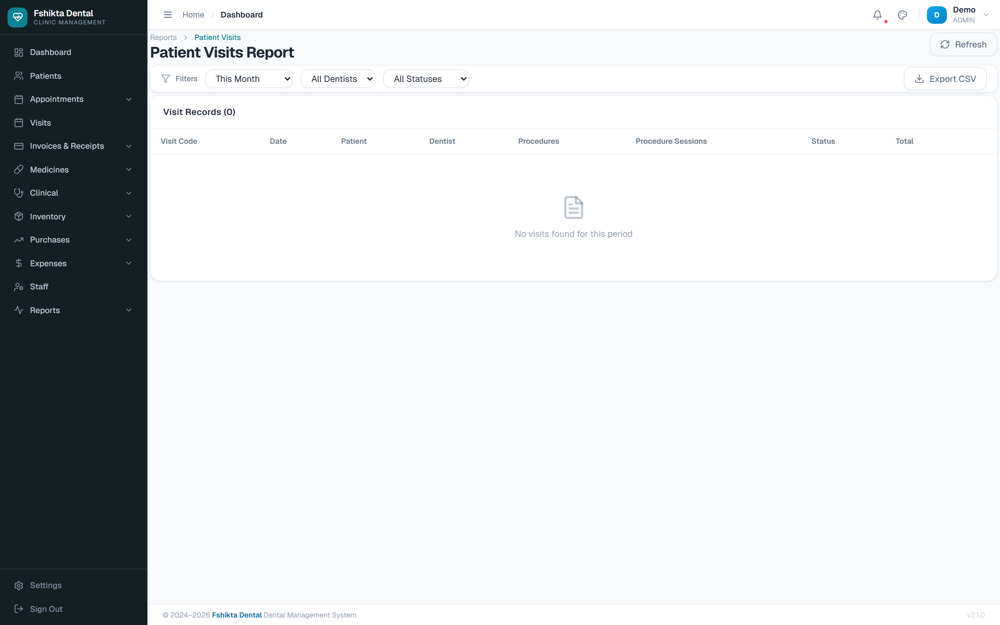

**Expenses & Payments**

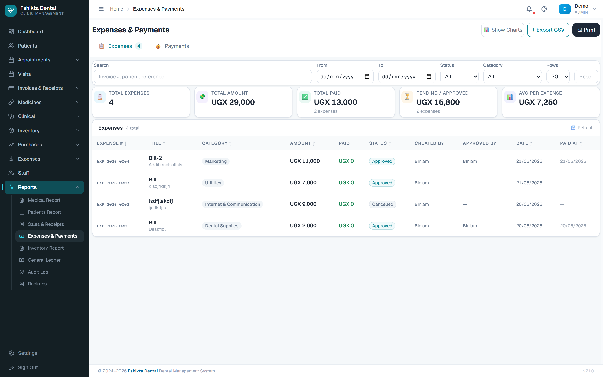

**Inventory Report**

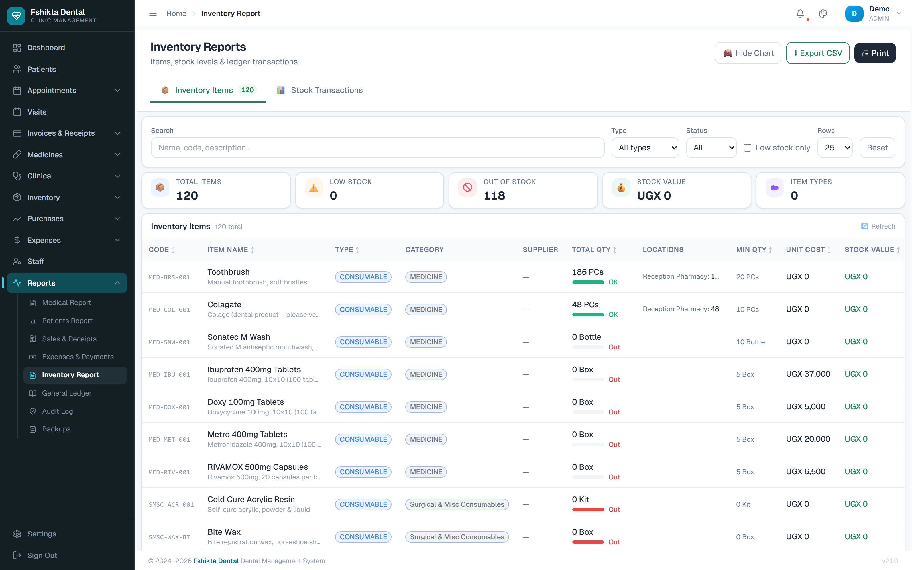

Most report pages carry a date-range filter and can be printed; financial reports also export to PDF and CSV where implemented.

---

## 3. Invoices and the money flow

Understand this one diagram and the accounting makes sense:

```
   DOCTOR completes visit
            |
            v
      INVOICE: DRAFT          editable, nothing in the accounts yet
            |
            |  Post Invoice
            v
      INVOICE: POSTED         DR Accounts Receivable / CR Revenue
            |
            |  Reception receives money
            v
   UNPAID -> PARTIALLY PAID -> PAID

   VOID  <- from DRAFT or POSTED, reason required,
            reverses ledger entries and voids receipts
```

| Status | Meaning | Accounting effect |
|---|---|---|
| **DRAFT** | Being built. Edit freely. | None |
| **POSTED** | Live bill. | Debit Accounts Receivable, credit Revenue |
| **VOID** | Cancelled with a reason. | Reverses the entries and voids receipts |

| Payment status | Badge |
|---|---|
| Unpaid | Slate |
| Partially Paid | Amber |
| Paid | Green |

### Creating or correcting an invoice

1. Open the visit and click the **Bills** icon.
2. **Add Items** — procedures, drugs or manual lines.
3. Adjust quantities, discounts and tax.
4. **Post Invoice**. The journal entry is created and any patient deposit is applied automatically.

**Discounts** can be a fixed amount or a percentage of the subtotal. Decide who is allowed to grant them and check the audit log against that rule.

**Multi-currency:** UGX is the base; USD and others are supported. The exchange rate at the moment of payment is stored on the receipt, so historical reports stay correct.

> **Never fix a wrong invoice by editing figures after payment.** Void it with a reason and issue a correct one. The audit trail is what protects the clinic in a dispute.

---

## 4. Receipts, payments and daily reconciliation

**Invoices & Receipts → Receipts**, and **Cash Flow → Payments**


Every receipt records the amount, currency, method, reference, who received it and when.

### End-of-day reconciliation

1. Open the day's receipts and group them by **payment method**.
2. **Cash** total must equal the money counted in the drawer.
3. **Mobile money** totals must match the MTN and Airtel statements.
4. **Card** totals must match the POS batch report.
5. **Bank transfer** and **cheque** entries must be traceable to the bank.
6. Investigate every difference the same day. A cash shortfall found a week later cannot be explained.

**Voiding a receipt** reverses the money and the ledger entries behind it. Keep this to yourself and one deputy, and require a written reason every time.

---

## 5. The general ledger

**Sidebar → General Ledger**

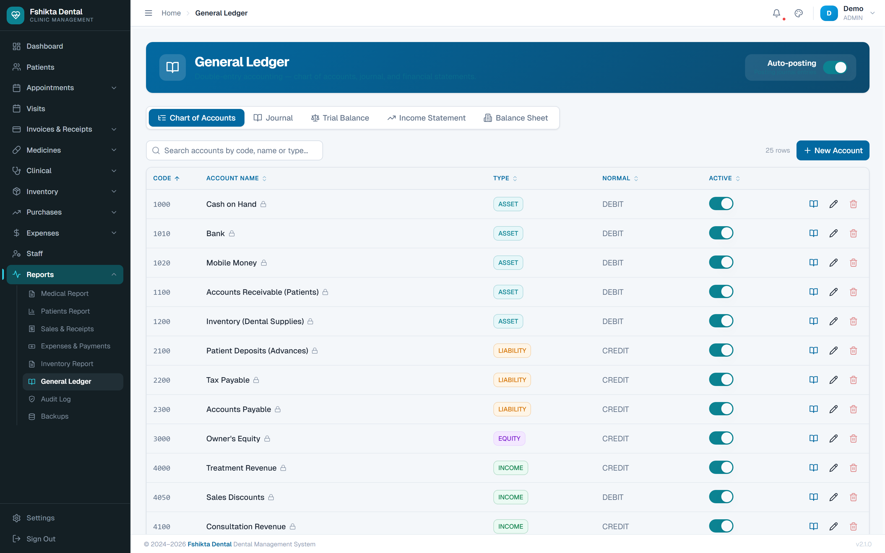

The system keeps proper double-entry books. The page has these tabs:

| Tab | Use |
|---|---|
| **Chart of Accounts** | The account tree. Click any account to view its ledger. |
| **Journal** | Every entry, newest first. Includes **Manual Journal Entry** and **Reverse entry**. |
| **Trial Balance** | As-of-date balances; totals for assets, liabilities, equity, revenue, expenses. |
| **Income Statement** | Revenue less expenses over a date range. |
| **Balance Sheet** | Position as at a date. |

### The accounts you will meet most

| Account | Type | What it holds |
|---|---|---|
| Accounts Receivable | Asset | What patients owe |
| Cash / Bank | Asset | Where the money sits |
| Inventory | Asset | Value of stock on hand |
| Fixed Assets | Asset | Equipment, furniture, computers |
| Patient Deposits | Liability | Money taken before treatment |
| Tax Payable | Liability | VAT or sales tax collected |
| Revenue (Treatment) | Income | Procedure income |
| Expenses | Expense | Rent, utilities, supplies, salaries |

### Manual journal entries

Use these only for genuine adjustments — accruals, depreciation, corrections, opening balances.

1. **Journal → Manual Journal Entry**.
2. Pick accounts, enter debits and credits, add a description.
3. Debits must equal credits.
4. Save.

To undo one, use **Reverse entry** rather than deleting it. The original and the reversal both stay visible, which is what an auditor expects.

### Closing a period
Reconcile, then close the period so transactions are locked and a summary is produced. Close monthly at minimum. Nothing dated inside a closed period should change afterwards.

---

## 6. Cash and bank accounts

**Sidebar → Accounts** (and **Cash Flow**)

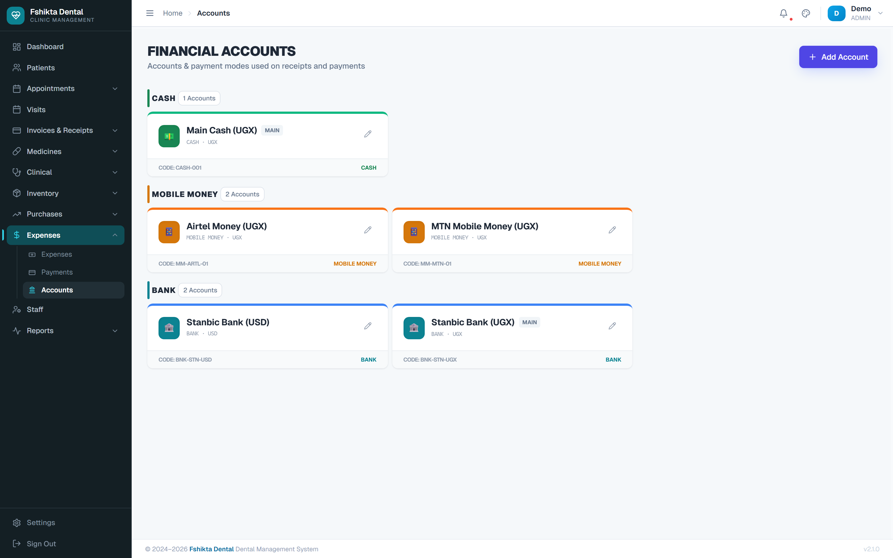

Each physical place money sits — the till, each mobile-money wallet, each bank account — should exist here, so that receipts and payments can be attributed and reconciled. Review balances against statements weekly.

---

## 7. Expenses

**Sidebar → Expenses**

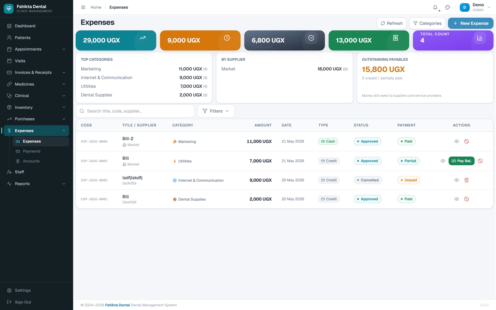

Record every cost: rent, utilities, salaries, consumables, repairs, transport.

1. Click **New Expense**.
2. Choose the **category**, the **supplier** if there is one, the amount and the date.
3. Attach the reference or document number.
4. Save. The entry posts to the general ledger automatically.

Approval is tracked, so an expense carries both the person who entered it and the person who approved it. Keep those two different people wherever you can.

### Expense categories
**Expenses → Categories** — keep the list short and stable. Renaming categories every quarter destroys your ability to compare periods.

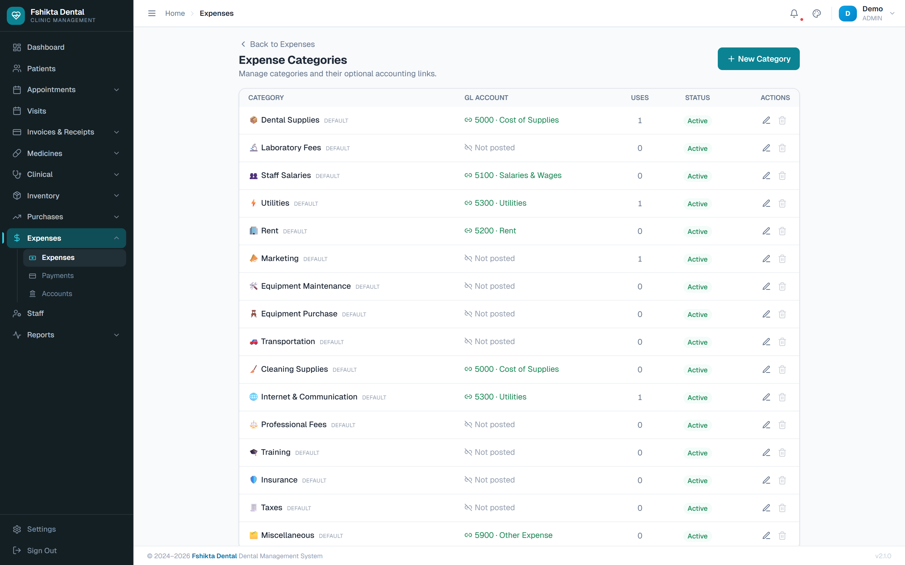

---

## 8. Fixed assets

**Sidebar → Fixed Assets**

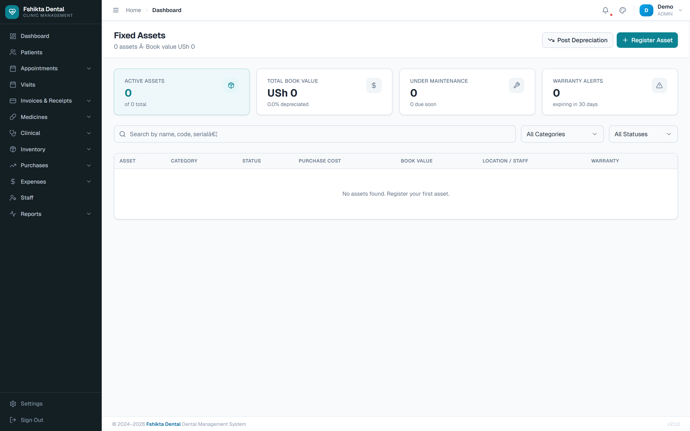

Register equipment worth tracking: chairs, X-ray units, autoclaves, compressors, computers, furniture. Each asset holds its cost, purchase date, depreciation schedule and the staff member it is assigned to.

Review the register twice a year: confirm each item physically exists, is where it should be, and still works. Write off what does not.

---

## 9. Suppliers and purchases

**Sidebar → Purchases → Suppliers** and **Purchases**

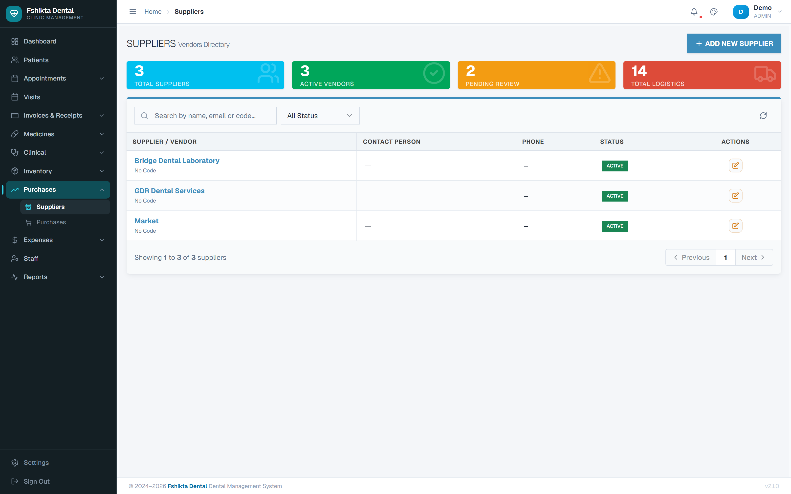

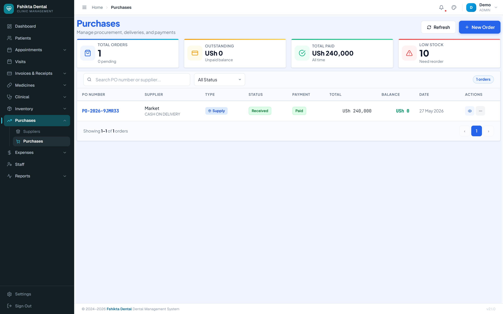

The normal cycle:

```
  Purchase order  ->  Goods received  ->  Stock increases
                                      ->  Supplier invoice
                                      ->  Supplier payment
```

1. Raise a **purchase order** against a supplier with items, quantities and prices.
2. When goods arrive, receive them against the order. Stock and inventory value go up.
3. Record the supplier payment under **Supplier Payments**.

Check that what was ordered, what was received and what was invoiced all agree before you pay. That three-way check is where most losses are caught.

---

## 10. Inventory and stock control

| Screen | Purpose |
|---|---|
| **Inventory Items** | The master list: item, unit, reorder level, current quantity |
| **Stock Out** | Issue stock to a department or a treatment |
| **Direct Stock** | Add stock that did not come through a purchase order |
| **Categories** | Grouping for reporting |
| **Stock Moves** | Every movement in and out |
| **Locations** | Stores, surgery cupboards, pharmacy — a tree of locations |
| **Damages/Expiry** | Write off damaged or expired goods, with a reason |
| **Adjustments** | Correct counts after a physical stock take |
| **Stock Ledger** | The full audit trail of quantity and value |

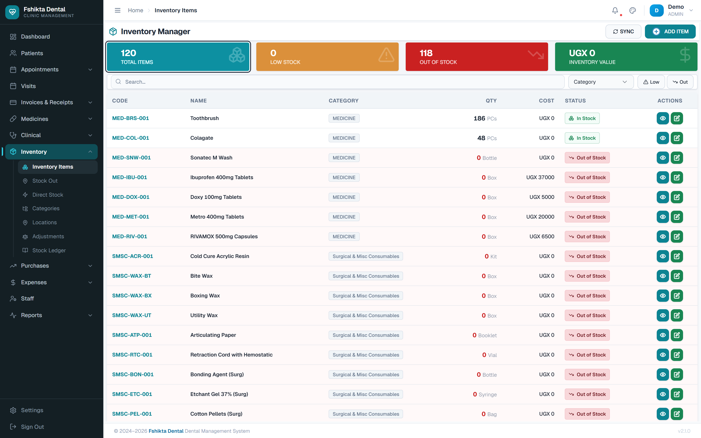

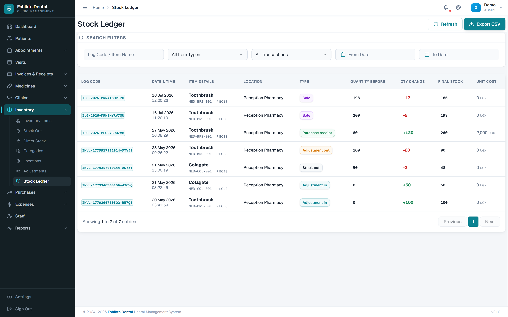

### How to run a stock take

1. Print the current quantities from **Inventory Items**.
2. Count physically, with two people, and write down what you find.
3. Enter differences through **Adjustments**, each with a reason.
4. Investigate anything large before you post it.
5. Compare the new inventory value against the ledger.

### Keeping stock honest day to day
- Clinical staff must log **materials used** when they execute a session (see the Doctors & Nurses Manual). If they do not, stock drifts and your valuation is fiction.
- Set **reorder levels** on fast-moving items; low-stock notifications depend on them.
- Write off expiry **as it happens**, not at year end.

---

## 11. Pharmacy

**Medicines → Pharmacy Sales**, **Drugs**, **Drug Categories**, **Prescriptions**


Pharmacy sales are revenue in their own right. Watch three things:

1. **Dispensed versus prescribed** — large gaps mean prescriptions are going elsewhere.
2. **Stock on hand versus sales** — reconcile monthly, exactly like consumables.
3. **Expiry dates** — review monthly and write off properly.

---

## 12. Price list (billing services)

**Sidebar → Services** (billing services)

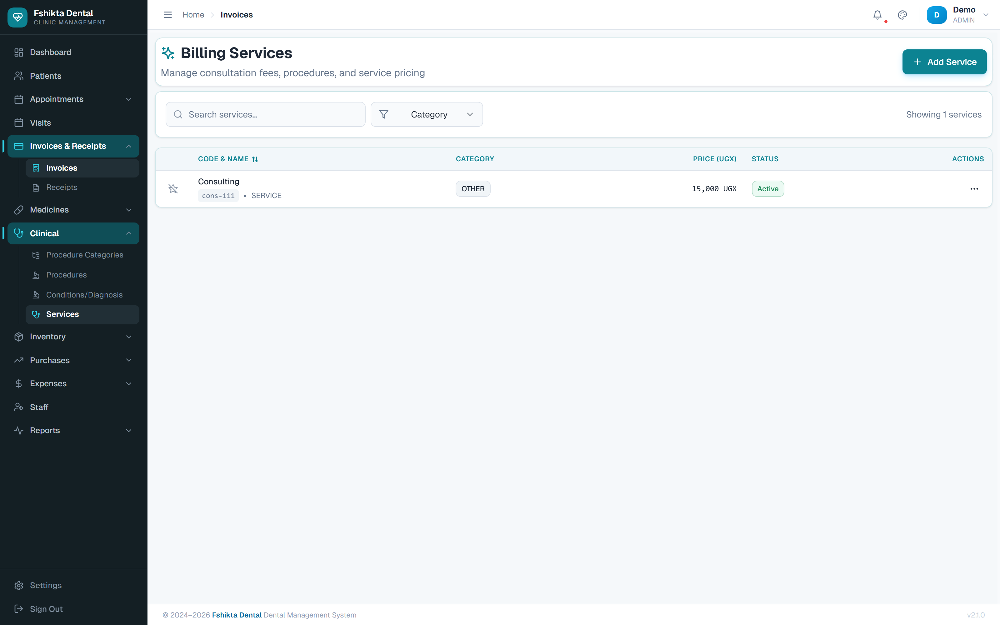

This is the clinic price list. Each service has a code, a category, a price and a pricing model:

| Pricing model | Charged as |
|---|---|
| Fixed | One flat price |
| Per Tooth | Price × teeth |
| Per Arch | Price per arch |
| Per Session | Price per session |
| Per Bracket | Price per bracket |
| Per Unit | Price per unit |

> A price change here affects **every new invoice**. Agree changes in writing, change them once, and tell reception and the clinical team the same day. Existing posted invoices are not altered.

---

## 13. Staff and access

**Sidebar → Staff**

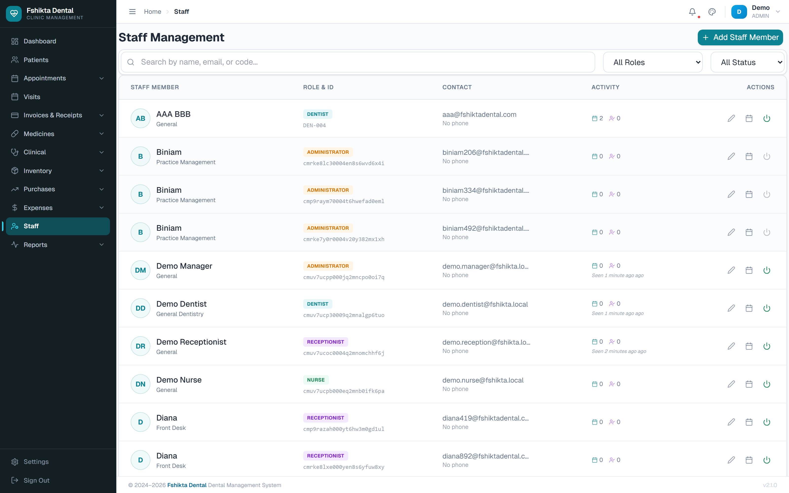

Each staff member has personal details, a linked login account and a role. Each role sees only what it needs:

| Role | Access |
|---|---|
| **Super Admin** | Everything, including user management |
| **Admin** | Everything operational — owner or general manager |
| **Dentist** | Clinical: visits, notes, chart, procedures, prescriptions, patient records |
| **Nurse** | Assists with visits, vitals and stock usage; limited billing |
| **Receptionist** | Registration, appointments, check-in, payments |
| **Pharmacist** | Drugs, dispensing, pharmacy sales |
| **Lab Technician** | Lab orders and imaging records |

### Rules worth enforcing

- **One login per person.** Shared logins destroy the audit trail and with it any ability to hold anyone accountable.
- **Give the smallest role that lets the person work.** Admin is not a courtesy.
- **Remove access the day someone leaves.** Deactivate the user; do not delete the staff record, because their historical entries must remain attributable.
- **Review the user list quarterly** and ask of each account: does this person still work here, and is this still the right role?

### Schedules and performance
- **Staff → dentist → Schedule**: working hours and days. The appointment system offers slots from this, so a wrong schedule means wrong bookings.
- **Staff → dentist → Performance**: performance notes and KPIs.

---

## 14. Clinic settings

**Sidebar → Settings**

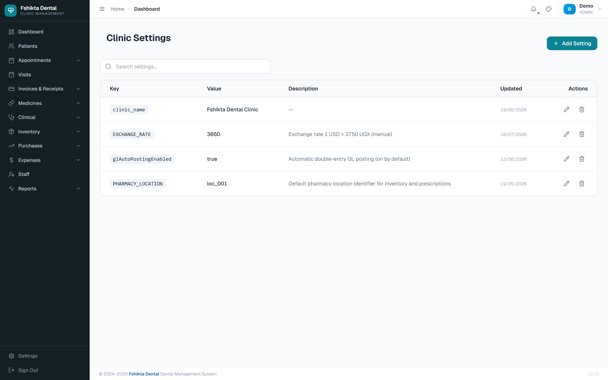

Settings are stored as a searchable list of **key / value / description** entries, which you can add, edit and delete. They control clinic-wide behaviour — numbering prefixes, defaults, tax and currency configuration.

> Change one setting at a time and note what you changed and why. A wrong key here can affect every document the system produces.

---

## 15. Audit log

**Sidebar → Audit Log**

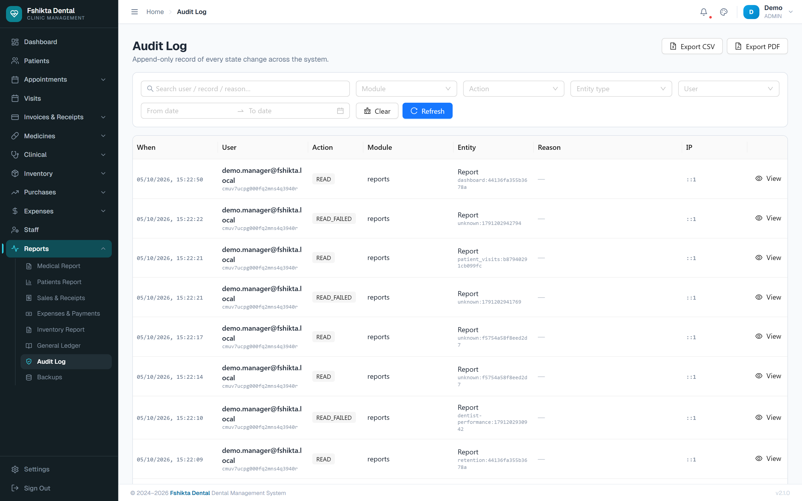

Every state change is recorded: who, what changed from what to what, when, and session details. The log is append-only — nobody, including you, can alter it.

Use it for:

| Situation | What to look for |
|---|---|
| Patient disputes a charge | The invoice and receipt history, and any voids |
| Cash does not balance | Receipts and voided receipts for that day and user |
| A clinical record looks wrong | Edit reasons on conditions, procedures and sessions |
| Stock discrepancy | Adjustments, write-offs and stock-out entries |
| Suspected misuse | One user's activity over a date range |

**Make a habit of it.** Spend ten minutes a week in the audit log looking at voids, deletions and edits with weak reasons. Staff behave differently when they know someone reads it.

---

## 16. Backups

**Sidebar → Backups** (admin only)

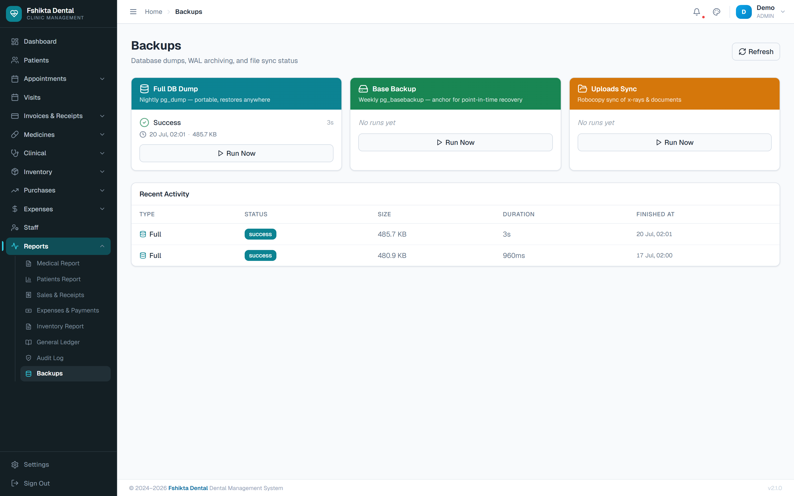

Three backup jobs exist:

| Job | What it saves |
|---|---|
| **Full DB Dump** | The complete database |
| **Base Backup** | A base copy of the database cluster for point-in-time recovery |
| **Uploads Sync** | Patient images and uploaded documents |

The page shows the status and age of each. Your responsibilities:

- **Check the page weekly.** A backup job that has quietly failed is the single worst risk in the clinic.
- **Keep a copy off site.** A backup on the same machine does not survive theft, fire or ransomware.
- **Test a restore** at least twice a year on a spare machine. An untested backup is an assumption, not a backup.
- Note that backups contain patient data. Store and transport them encrypted, and restrict who can reach them.

---

## 17. Routines: daily, weekly, monthly

### Every day
- [ ] Look at the dashboard: appointments and revenue.
- [ ] Reconcile cash, mobile money and card against receipts (section 4).
- [ ] Check no visit is left incomplete and no appointment stuck on **Arrived**.
- [ ] Glance at voids and deletions in the audit log.

### Every week
- [ ] Unpaid and partially paid invoices — chase the debt.
- [ ] Backup status page.
- [ ] Low-stock notifications; raise purchase orders.
- [ ] Supplier invoices against goods received.
- [ ] Bank and wallet balances against statements.

### Every month
- [ ] Post all expenses for the month.
- [ ] Depreciation on fixed assets.
- [ ] Physical stock take and adjustments.
- [ ] Pharmacy stock and expiry review.
- [ ] Trial balance; investigate anything odd.
- [ ] Income statement and balance sheet; compare against last month.
- [ ] Close the accounting period.
- [ ] Dentist performance review.
- [ ] Patient growth and retention review.

### Every quarter
- [ ] User-access review — who should still have an account, and at what role.
- [ ] Price list review.
- [ ] Test a backup restore (at least twice a year).
- [ ] Fixed-asset verification (at least twice a year).

---

## 18. Common problems and fixes

| Problem | What to do |
|---|---|
| Revenue looks too low for the day | Check for invoices still in **Draft** — the doctor has not completed the visit, so nothing is billable. |
| Revenue and collected differ widely | Normal if patients pay later; investigate if the gap keeps growing. Chase unpaid invoices. |
| Cash short at close | Receipts for that day by user and method, then the audit log for voided receipts. |
| Trial balance does not balance | Look for a manual journal entry with unequal debits and credits, then reverse and re-enter it. |
| Stock on screen differs from the shelf | Materials are not being logged during treatment, or stock-out is skipped. Fix the behaviour, then adjust with a reason. |
| Inventory value does not match the ledger | Check write-offs and adjustments were posted, not just recorded. |
| A price change did not reach an invoice | Posted invoices keep the price they were posted with. Only new invoices use the new price. |
| A former employee can still log in | Deactivate the user account immediately; keep the staff record. |
| A backup job shows an old date | Treat it as urgent. Check disk space and the backup folder, then call technical support. |
| Someone deleted something they should not have | It is almost certainly a soft delete and recoverable. Find it in the audit log before taking any other action. |

---

## Quick reference

| Term | Meaning |
|---|---|
| **A/R** | Accounts Receivable — money patients owe |
| **Posted** | Invoice is live and in the accounts |
| **Void** | Cancelled with a reason; entries reversed |
| **Double entry** | Every transaction debits one account and credits another |
| **Trial balance** | List of account balances at a date; debits must equal credits |
| **Soft delete** | Hidden from view but retained in the audit trail |
| **Stock ledger** | Full history of stock quantity and value |
| **Reorder level** | Quantity that triggers a low-stock alert |
| **Period close** | Locking a month so its figures cannot change |

---

*For front-desk procedures see the **Receptionist Manual**. For clinical screens see the **Doctors & Nurses Manual**.*
